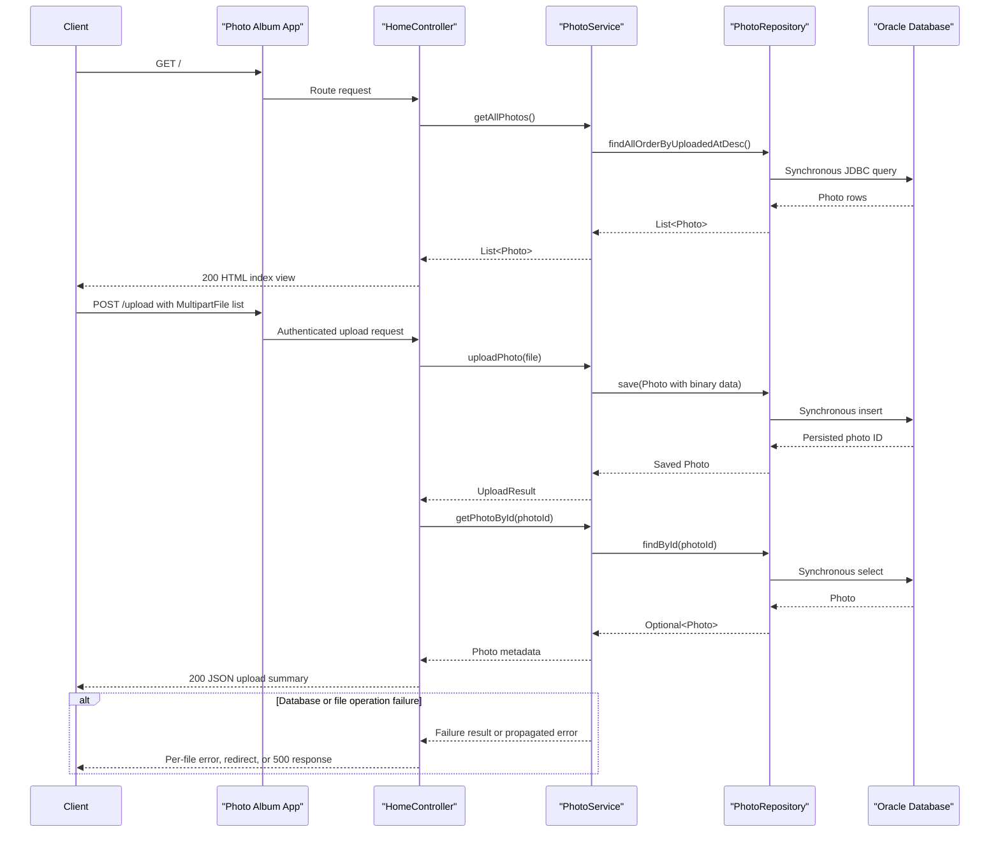

# API & Service Communication Contracts

The application exposes five HTTP routes for a server-rendered photo gallery, file upload, photo retrieval, and deletion. Communication is synchronous: requests are handled in-process by Spring MVC, with synchronous JPA/JDBC access to the Oracle database and no inter-service messaging.

## Service Catalog

| Service | Port | Category | Purpose |
|---|---:|---|---|
| `photoalbum-java-app` (`photo-album`) | 8080 | API Layer | Server-rendered gallery, JSON upload API, photo binary serving, and photo deletion. Uses Spring Boot Web/MVC, Thymeleaf, Spring Data JPA, Bean Validation, Spring Security, Jackson, and Oracle JDBC. |
| `oracle-db` (third-party `gvenzl/oracle-free:latest`) | 1521 | Infrastructure | Stores photo metadata and binary photo data in Oracle Database Free. The application connects through JDBC using the Docker Compose service name. |

## API Endpoints Inventory

| Service | Method | Path | Request Type | Response Type |
|---|---|---|---|---|
| `photoalbum-java-app` / `HomeController` | GET | `/` | No request body | Thymeleaf `index` view containing `List<Photo>`; redirects are not normally used. |
| `photoalbum-java-app` / `HomeController` | POST | `/upload` | Multipart form field `files`, a list of `MultipartFile` values | JSON object containing `success`, `uploadedPhotos`, and `failedUploads`; `400 Bad Request` when no files are supplied, otherwise `200 OK`. Requires HTTP Basic authentication. |
| `photoalbum-java-app` / `DetailController` | GET | `/detail/{id}` | Path parameter `id` (`String`) | Thymeleaf `detail` view containing a `Photo` and previous/next photo IDs; redirects to `/` when the ID is invalid, missing, or lookup fails. |
| `photoalbum-java-app` / `DetailController` | POST | `/detail/{id}/delete` | Path parameter `id` (`String`) | Redirect to `/` with a success or error flash message. Requires HTTP Basic authentication. |
| `photoalbum-java-app` / `PhotoFileController` | GET | `/photo/{id}` | Path parameter `id` (`String`) | Photo binary as `Resource` with the stored MIME type and cache-control headers; `404 Not Found` for invalid, missing, or empty data and `500 Internal Server Error` for an unexpected serving failure. |

No explicit API versioning scheme is present. The application uses conventional URL paths and has no OpenAPI or Swagger specification.

## Management & Observability Endpoints

| Service | Endpoint | Custom Metrics (if any) |
|---|---|---|
| `photoalbum-java-app` | None identified | None identified |

Spring Boot Actuator is not included or configured, so `/actuator/health`, `/actuator/info`, `/actuator/metrics`, and `/actuator/prometheus` are not exposed. No custom Micrometer metric annotations or registrations were found.

## DTOs & Contracts

`Photo` is the service-level persistence/domain model used as the response model for gallery and detail views and as the source for photo metadata and binary responses. It is a mutable JPA entity, not an immutable API DTO. Persistence fields and ORM details are documented by the data architecture assessment.

`UploadResult` is a mutable service-level operation result used internally between `PhotoService` and `HomeController`. It carries upload success, file name, error message, and photo ID; the controller maps it into a generic JSON `Map` response rather than exposing `UploadResult` directly.

The upload response is a controller-level aggregation structure made from generic maps. It contains metadata for each successfully persisted photo and per-file errors for failures; it does not aggregate data from multiple services. Thymeleaf model attributes (`photos`, `photo`, `previousPhotoId`, and `nextPhotoId`) are server-side view contracts rather than gateway DTOs.

Jackson provides JSON serialization for the upload response. Thymeleaf serializes the server-side model into HTML views. No custom serializer, protobuf schema, GraphQL schema, OpenAPI document, or Swagger annotations were identified.

## Communication Patterns

All application calls are synchronous and in-process:

- Spring MVC controllers call the `PhotoService` interface directly.
- `PhotoServiceImpl` calls `PhotoRepository`, a Spring Data JPA repository, synchronously.
- JPA uses synchronous JDBC calls to Oracle on `oracle-db:1521/FREEPDB1`.
- There are no REST clients, Feign clients, WebClient/RestTemplate calls, gRPC calls, message brokers, queues, events, or pub/sub integrations.

No circuit breaker, retry, timeout, bulkhead, or fallback policy is configured in the application. Controller methods provide route-specific error responses or redirects, and the service logs and propagates database failures; these are not resilience policies around a downstream service.

There is no service discovery or client-side load balancing. The application uses the Docker Compose DNS name `oracle-db` as a fixed database host. There is no API gateway or gateway aggregation layer; the upload response is assembled locally from per-file service results.

Docker Compose starts the application after the Oracle container reports healthy. This dependency affects initial API availability, but the application has no separate startup orchestration or readiness endpoint.

API-level security uses stateless HTTP Basic authentication with an in-memory admin user. `POST /upload` and `POST /detail/{id}/delete` require authentication; read-only routes are publicly permitted. Authorization is limited to the authenticated admin account and `ADMIN` role configuration, with no route-specific role annotation. CSRF is disabled for the stateless JSON upload flow. HTTPS/TLS is not configured, so transport security depends on an external deployment layer.

## Service Technology Matrix

| Service | Web | Data Access | Discovery | Gateway | Actuator | Cache | Metrics |
|---|---|---|---|---|---|---|---|
| `photoalbum-java-app` | Spring MVC + Thymeleaf | Spring Data JPA / Hibernate / Oracle JDBC | None | None | None | None identified | None identified |
| `oracle-db` | None | Oracle Database Free | None | None | Docker healthcheck only | Database-managed only; no application cache identified | None identified |

## Service Communication Sequence

