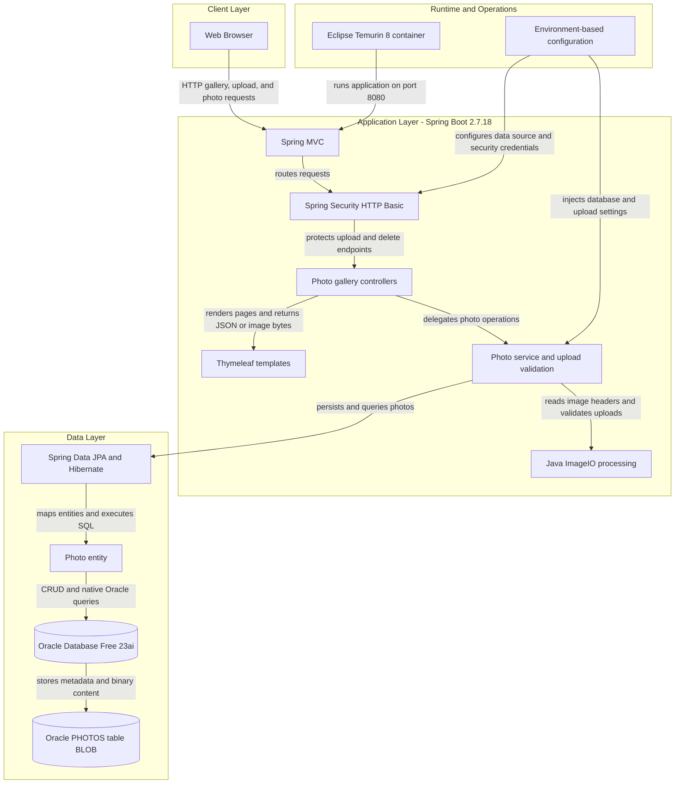
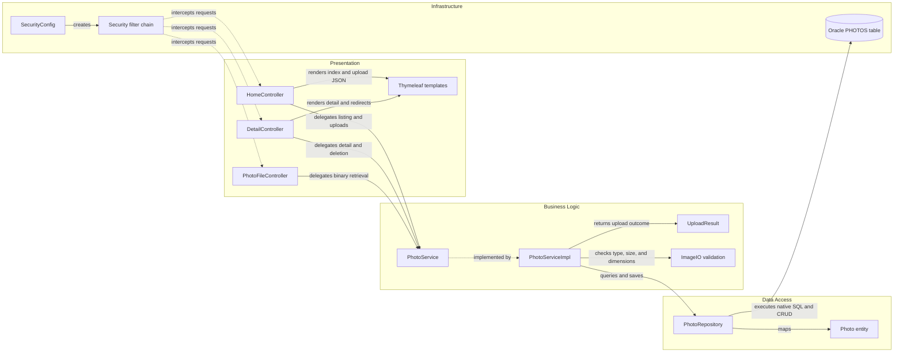

# Architecture Diagram

Photo Album is a single-module Spring Boot web application that serves a server-rendered photo gallery, accepts image uploads, and stores photo metadata and binary content in Oracle Database. The application is packaged as a Java 8 container and can run with an Oracle database through Docker Compose.

## Application Architecture

### Technology Stack Summary

| Layer | Technology | Version | Purpose |
|---|---|---|---|
| Runtime | Java | 8 | Application runtime and compilation target |
| Application | Spring Boot | 2.7.18 | Application bootstrap and auto-configuration |
| Presentation | Spring MVC | 5.3.x via Spring Boot | HTTP routing and controller handling |
| Presentation | Thymeleaf | Spring Boot managed | Server-side gallery and detail page rendering |
| Security | Spring Security | 5.7.x via Spring Boot | Stateless HTTP Basic authentication for state-changing endpoints |
| Business Logic | Spring service layer | Project code | Upload validation, image metadata extraction, navigation, and lifecycle operations |
| Data Access | Spring Data JPA and Hibernate | Spring Boot managed | Entity persistence and repository abstraction |
| Database Driver | Oracle JDBC ojdbc8 | Maven managed | JDBC connectivity to Oracle |
| Data Storage | Oracle Database Free 23ai | Docker image latest | Photo metadata and BLOB content storage |
| Containerization | Maven and Eclipse Temurin Docker images | Maven 3.9.6, Java 8 | Multi-stage build and application runtime |
| Validation | Spring Validation and ImageIO | Spring Boot managed, JDK 8 | Request constraints, MIME and size checks, and image dimension checks |

### Data Storage & External Services

Oracle Database is the only external service dependency. The `Photo` entity stores metadata and the image bytes in the `PHOTOS` table, with Oracle-specific native SQL for ordering, navigation, pagination, month filtering, and statistics. Docker Compose runs Oracle Database Free with a named data volume and connects the application over a private bridge network. There is no cache, message broker, remote API, or object-storage integration; the file path fields are retained for compatibility while photo serving reads BLOB data from Oracle.

### Key Architectural Decisions

- Uses a layered Spring MVC, service, and repository design with constructor injection between controllers, services, and data access.
- Stores photo binaries directly in Oracle BLOB columns rather than using a filesystem or object store.
- Protects upload and delete operations with stateless HTTP Basic authentication while leaving read-only gallery operations public.

## Component Relationships

### Component Inventory

| Component | Layer | Type | Responsibility |
|---|---|---|---|
| HomeController | Presentation | Spring MVC controller | Displays the gallery and handles multi-file upload requests |
| DetailController | Presentation | Spring MVC controller | Displays a photo, computes adjacent-photo navigation, and handles deletion |
| PhotoFileController | Presentation | Spring MVC controller | Reads photo bytes and serves them with the stored MIME type |
| Thymeleaf templates | Presentation | Server-rendered views | Renders the gallery, photo detail, and shared layout pages |
| PhotoService | Business Logic | Service interface | Defines photo listing, retrieval, upload, deletion, and navigation operations |
| PhotoServiceImpl | Business Logic | Spring service | Validates uploads, extracts dimensions, creates entities, and coordinates persistence |
| UploadResult | Business Logic | Result model | Carries upload success, file name, photo ID, and error details |
| ImageIO validation | Business Logic | JDK image processing | Inspects image headers and enforces the maximum pixel limit |
| PhotoRepository | Data Access | Spring Data JPA repository | Provides CRUD operations and Oracle native queries for photo retrieval |
| Photo | Data Access | JPA entity | Maps photo metadata and BLOB content to the `PHOTOS` table |
| SecurityConfig | Infrastructure | Spring configuration | Defines password encoding, in-memory admin identity, and endpoint authorization |
| Security filter chain | Infrastructure | Spring Security filter | Applies stateless HTTP Basic authentication to protected requests |
| Oracle PHOTOS table | Infrastructure | Relational database storage | Stores photo metadata and binary image content |
