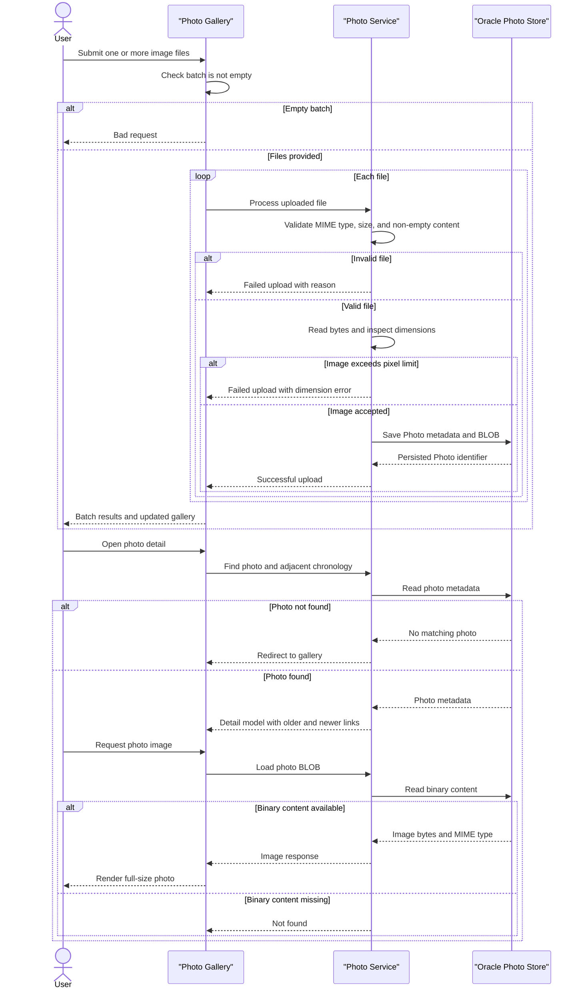

# Core Business Workflows

Photo Album is a single-user-facing photo gallery for uploading, storing, browsing, viewing, and deleting image files. Users can inspect photo metadata and move chronologically through the gallery.

## Domain Entities

| Entity | Service / Bounded Context | Description | Key Relationships |
|---|---|---|---|
| Photo | Photo Gallery | The aggregate representing an uploaded image, its binary content, identifying metadata, dimensions, MIME type, and upload time. | A gallery contains many Photos; chronological ordering determines previous and next navigation. |
| UploadResult | Photo Gallery | The outcome of processing one upload, including success state, original filename, failure reason, or the stored photo identifier. | Created by the upload workflow and used by the gallery endpoint to build batch feedback. |

## Service-to-Domain Mapping

| Service | Domain Context | Owned Entities | External Dependencies |
|---|---|---|---|
| Photo gallery application | Photo Gallery | Photo, UploadResult | Oracle database for photo metadata and BLOB content; browser UI for upload and display |

This is a modular monolith rather than a multi-service system. The application is the source of truth for all photo metadata and binary content. There are no cross-service events, REST calls between services, or shared database boundaries.

## Primary Workflows

### Workflow 1: Browse the gallery

1. A user opens `GET /`.
2. `HomeController` asks `PhotoService` for all photos.
3. `PhotoRepository` returns photos ordered newest first by upload time.
4. The controller renders the gallery, including metadata and links to each photo detail page.
5. If retrieval fails, the page is rendered with an empty gallery and the error is logged; this presents the user with the no-photos state rather than partial data.

### Workflow 2: Upload one or more photos

1. A user selects or drops files in the gallery. The browser rejects unsupported MIME types and files over 10 MB before submission when possible.
2. The browser submits `POST /upload` as multipart form data. An empty batch is rejected with a bad-request response.
3. For each file, `PhotoService` checks the configured MIME allowlist, the 10 MB size limit, and that the file is non-empty.
4. The service reads the bytes, inspects image dimensions without fully decoding the image, and rejects images exceeding 40 million pixels.
5. A UUID-backed `Photo` is created with the original filename, generated compatibility filename, metadata, dimensions where available, and BLOB content.
6. The repository saves the photo in Oracle. The service returns an `UploadResult`; the controller fetches each successfully saved photo and returns uploaded and failed items in one response.
7. The browser prepends successful photos to the gallery and displays per-file failures. A batch can therefore partially succeed.

### Workflow 3: View a photo and navigate chronologically

1. A user opens `GET /detail/{id}` from the gallery.
2. The controller loads the requested photo. If the identifier is blank, the photo does not exist, or loading fails, the user is redirected to the gallery.
3. For an existing photo, the service queries the nearest older and newer photos by upload timestamp and supplies their identifiers to the detail page.
4. The page displays the photo metadata and obtains the binary content through `GET /photo/{id}`.
5. The file endpoint loads the photo BLOB, returns it with its MIME type, or returns not found when the photo or binary content is unavailable.

### Workflow 4: Delete a photo

1. An authenticated administrator confirms deletion from the detail page, submitting `POST /detail/{id}/delete`.
2. Security permits the state-changing request only for an authenticated user.
3. `PhotoService` looks up the photo and deletes the database record, including its BLOB, when found.
4. The user is redirected to the gallery with a success message. A missing photo produces a not-found message, while an operational failure produces an error message.

## Cross-Service Data Flows

There are no cross-service data flows. The web controllers, application service, repository, and Oracle database form one deployment boundary.

Within that boundary, the gallery composition flow joins data from the `Photo` aggregate with its BLOB content: the gallery and detail views obtain metadata through the application, while the image element separately requests `/photo/{id}` to retrieve the binary representation. Detail navigation composes the current photo with the nearest older and newer records based on upload timestamps.

No circuit breaker, remote-service fallback, event choreography, or cross-service eventual consistency is implemented. Business degradation is local: a missing or unreadable photo is shown as not found, and gallery retrieval errors result in an empty gallery view.

## Business Workflow Sequence

## Business Rules & Decision Logic

### Validation rules

- Accepted upload MIME types are JPEG, PNG, GIF, and WebP.
- Each file must be non-empty and no larger than 10 MB; the multipart request is limited to 50 MB.
- A configured maximum of 10 files per upload exists, although the current service implementation validates each supplied file and does not enforce that batch limit in its loop.
- Image dimensions are inspected from the image header, and images over 40 million pixels are rejected to limit decompression-bomb risk.
- A photo requires an original filename, generated stored filename, positive file size, MIME type, and upload timestamp for a valid persisted record.
- Blank photo identifiers are rejected at detail and file-serving entry points.

### Decision logic and computed values

- Upload processing is independent per file, so valid files are saved while invalid files are reported individually.
- Stored identifiers and compatibility filenames are generated with UUIDs.
- Gallery results are sorted newest first.
- Previous navigation selects the nearest older photo; next navigation selects the nearest newer photo.
- Width and height are optional when dimension extraction cannot be completed; the upload can still proceed after a non-I/O dimension extraction failure.
- The browser calculates display sizes and cache-busting query values; the server returns no-cache headers for photo content.

### State transitions and integrity

- A photo moves from submitted to rejected, or from submitted to persisted and available for browsing, serving, navigation, and deletion.
- Deletion removes the photo record and its database-stored binary content from the application store.
- A successful upload response is only reported after repository persistence succeeds and the saved photo can be looked up for response metadata.
- There are no multi-entity aggregates, approval states, audit trail, or business event state machine.

### Cross-cutting concerns

- Photo operations execute within the service transaction boundary; read operations use read-only transactions.
- Persistence failures are logged and surfaced as upload failure, redirect, not-found, or server-error behavior according to the entry point.
- Public read operations include the gallery, detail pages, and photo content. Upload and delete operations require authenticated administrator credentials over HTTP Basic authentication.
- Business actions are logged for successful uploads and deletions, as well as validation and persistence failures. No separate audit history is maintained.
