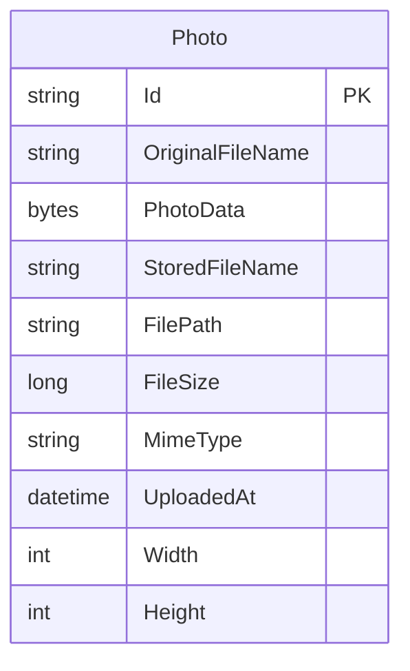

# Data Architecture & Persistence Layer

The application has one JPA entity, `Photo`, persisted by Spring Data JPA/Hibernate. Normal and Docker execution use Oracle Database, while tests use an in-memory H2 database; uploaded image bytes are stored as a database LOB.

## Database Configuration

| Service/Module | DB Type | Profile | Driver | Connection | Migration Tool |
|---|---|---|---|---|---|
| Photo Album application | Oracle | Default/production-like | Oracle JDBC `ojdbc8` | JDBC URL, username, and password are supplied through environment-backed configuration; the default URL targets the Oracle `FREEPDB1` service | None; Hibernate creates the schema at startup |
| Photo Album application | Oracle | Docker | Oracle JDBC `ojdbc8` | Environment-backed Oracle connection to the `oracle-db` service on port 1521, service `FREEPDB1` | None; Hibernate creates the schema at startup |
| Photo Album application | H2 | Test | H2 JDBC driver | In-memory `testdb` database | None; Hibernate creates and drops the test schema |

Connection pooling uses Spring Boot's default JPA data-source behavior; no project-specific pool size or timeout settings were found. The Oracle initialization scripts create the application schema user and grant schema-scoped object-creation privileges. No seed data, Flyway migrations, Liquibase changelogs, or application-owned versioned SQL migrations were found.

## Data Ownership per Service

| Service | Tables Owned | ORM Framework | Caching | Notes |
|---|---|---|---|---|
| Photo Album application (`com.photoalbum`) | `photos` (`Photo`) | Spring Data JPA with Hibernate | None detected | The service owns photo metadata and binary image content in the same Oracle table. |

## Entity Model

`Photo` is defined in `src/main/java/com/photoalbum/model/Photo.java` and maps to the `photos` table. Its identifier is an application-generated UUID string. `photoData` is a nullable LOB containing the uploaded image bytes; the remaining columns hold filename, path compatibility metadata, size, MIME type, upload timestamp, and optional image dimensions. The upload timestamp has an index for ordering queries. Bean Validation annotations define required, positive, and maximum-length field constraints.

The model has no entity relationships or foreign keys. Transaction boundaries are declared on `PhotoServiceImpl` with class-level read-write transactions and method-level read-only transactions for retrieval operations. Repository operations therefore run through the service transaction boundary.

## Key Repository Methods

| Service | Repository | Notable Methods | Purpose |
|---|---|---|---|
| Photo Album application | `PhotoRepository extends JpaRepository<Photo, String>` (`src/main/java/com/photoalbum/repository/PhotoRepository.java`) | `findAllOrderByUploadedAtDesc()` | Native query returning all photos ordered newest first. |
| Photo Album application | `PhotoRepository` | `findPhotosUploadedBefore(LocalDateTime uploadedAt)` | Oracle-native navigation query returning up to ten older photos. |
| Photo Album application | `PhotoRepository` | `findPhotosUploadedAfter(LocalDateTime uploadedAt)` | Oracle-native navigation query returning newer photos in ascending upload order. |
| Photo Album application | `PhotoRepository` | `findPhotosByUploadMonth(String year, String month)` | Filters photos by year and month using Oracle `TO_CHAR`. |
| Photo Album application | `PhotoRepository` | `findPhotosWithPagination(int startRow, int endRow)` | Implements row-range pagination using Oracle `ROWNUM`. |
| Photo Album application | `PhotoRepository` | `findPhotosWithStatistics()` | Returns raw `Object[]` rows with Oracle analytic ranking and running file-size totals. |

Standard CRUD methods inherited from `JpaRepository` are omitted. All custom queries are native SQL and several depend on Oracle-specific functions or pagination semantics, which couples the repository to Oracle.

## Caching Strategy

No application-level caching was detected. The project does not use Spring Cache annotations, Redis, Caffeine, Ehcache, JCache, Hibernate second-level cache, query-result caching, or an explicit cache provider. Photo reads therefore query the database directly, including retrieval of the stored LOB when the entity is loaded.

## Data Ownership Boundaries

This is a single-module application with one shared persistence boundary: the application owns and directly reads and writes the `photos` table in one Oracle schema. There are no separate services, isolated stores, service-to-service calls, outbox records, or cross-service aggregation methods. H2 is an isolated, test-only substitute for the Oracle store.

The service uses a conventional transactional read/write pattern rather than CQRS. Upload and delete operations write the entity through `PhotoRepository`; listing, lookup, navigation, month filtering, pagination, and statistics are read operations. The repository's native SQL is an internal data-access boundary, not an API for another service.

### Data Classification & Sensitivity

| Entity | Sensitive Fields | Classification (PII/PHI/PCI/None) | Controls in Place |
|---|---|---|---|
| `Photo` | No explicit person, contact, health, or payment fields; `OriginalFileName` and uploaded image content may contain user-supplied information | None for structured fields; uploaded media may be sensitive depending on its contents | No field-level encryption, masking, or access-control mechanism was identified in the entity. Database access is protected by schema credentials supplied through environment variables; no application-level data masking was found. |
