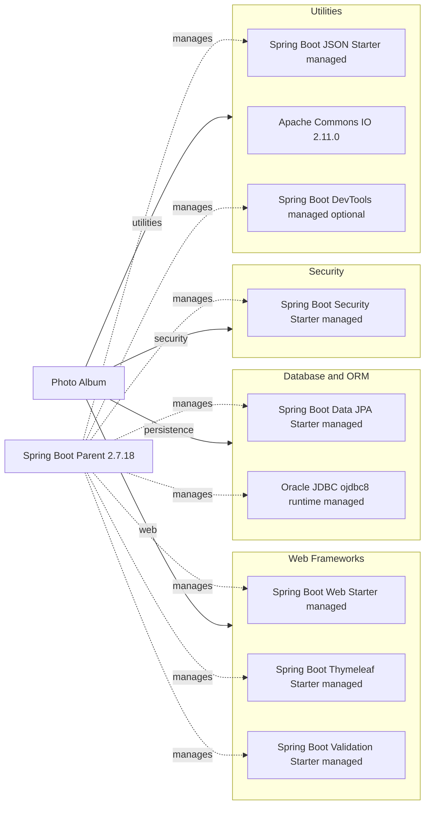

# Dependency Map

Photo Album is a single-module Maven application with 11 declared external dependencies: 9 main/runtime dependencies and 2 test-scope dependencies. Spring Boot 2.7.18 manages versions for most Spring, persistence, and JSON components through its parent POM.

## Dependencies

### Dependency Summary

| Category | Count | Key Libraries | Notes |
|---|---:|---|---|
| Web Frameworks | 3 | Spring Boot Web, Thymeleaf, Validation | Spring MVC application with server-side templates and bean validation |
| Database and ORM | 2 | Spring Data JPA, Oracle ojdbc8 | JPA persistence with Oracle at runtime |
| Security | 1 | Spring Security | Protects state-changing endpoints |
| Utilities | 3 | Spring Boot JSON, Apache Commons IO, Spring Boot DevTools | JSON support, file operations, and optional development tooling |
| **Main/runtime total** | **9** |  |  |

### Version & Compatibility Risks

The application targets Java 8 and Spring Boot 2.7.18, which is a maintenance-line release and uses the pre-Jakarta `javax` ecosystem. Modernization to Spring Boot 3 or 4 requires Java 17 or later, `jakarta` namespace changes, and upgrades across Hibernate, Spring Security, validation, and other managed transitive dependencies. Apache Commons IO 2.11.0 is explicitly pinned and should be reviewed for security and compatibility updates. The Oracle `ojdbc8` runtime driver is tied to the Java 8 generation and should be replaced with a driver compatible with the target Java runtime.

### Notable Observations

- Spring Boot's parent POM centrally manages versions for the starter dependencies and much of their transitive dependency tree.
- Oracle JDBC is runtime-scoped, while H2 is test-scoped, so production and test database engines differ.
- Spring Boot DevTools is optional but declared without a dedicated development profile; it should not be included in production packaging.
- The explicitly pinned Commons IO version is outside Spring Boot dependency management and requires independent upgrade tracking.

## Test Dependencies

| Framework | Version | Notes |
|---|---|---|
| Spring Boot Test Starter | Managed by Spring Boot 2.7.18 | Test starter; transitively supplies the Spring test framework, JUnit, Mockito, AssertJ, and JSON test support |
| H2 Database | Managed by Spring Boot 2.7.18 | In-memory database for tests; not used as the production database |

Total test-scope dependencies: 2

The project has a conventional Spring Boot test stack and an in-memory database, but no separately declared integration-test, containerized database, or contract-testing infrastructure.
