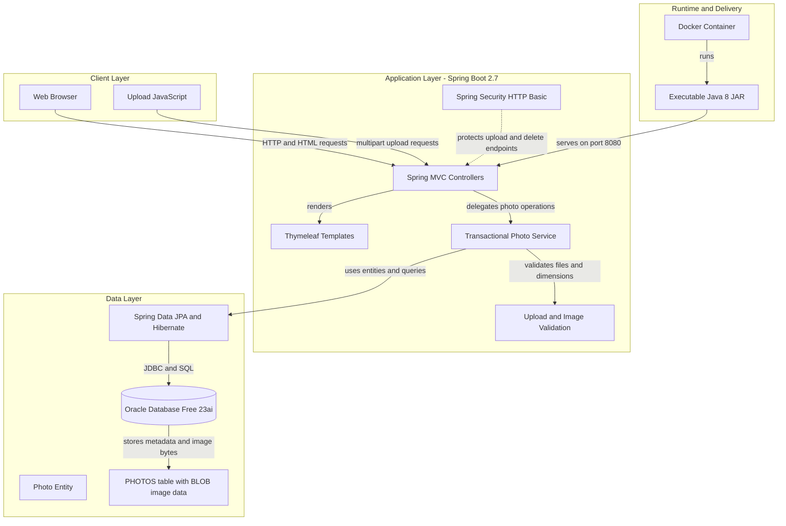
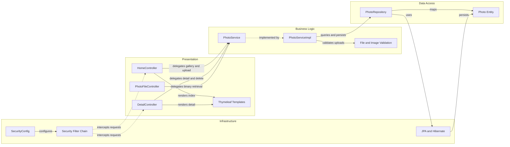

# Architecture Diagram

PhotoAlbum-Java is a single-module Spring Boot web application that provides a server-rendered photo gallery and JSON-based uploads. It uses Spring Security for endpoint protection and persists photo metadata and binary image data in Oracle Database.

## Application Architecture

### Technology Stack Summary

| Layer | Technology | Version | Purpose |
|---|---|---|---|
| Runtime | Java | 8 | Application runtime and compilation target |
| Build | Maven | 3.9.6 in Docker | Dependency resolution and packaging |
| Application | Spring Boot | 2.7.18 | Bootstrapping and embedded web runtime |
| Presentation | Spring MVC | Spring Boot managed | Routes HTML pages, JSON upload responses, and photo resources |
| Presentation | Thymeleaf | Spring Boot managed | Server-side rendering of gallery and detail pages |
| Security | Spring Security | Spring Boot managed | Stateless HTTP Basic authentication for state-changing endpoints |
| Business Logic | Spring services and transactions | Spring Boot managed | Photo upload, retrieval, navigation, and deletion workflows |
| Data Access | Spring Data JPA and Hibernate | Spring Boot managed | Repository abstraction and ORM persistence |
| Database | Oracle Database Free | 23ai container image | Stores photo metadata and image BLOBs |
| Database Driver | Oracle JDBC ojdbc8 | Maven managed | JDBC connectivity to Oracle |
| Packaging | Docker and Spring Boot JAR | Temurin 8 | Containerized application delivery |

### Data Storage & External Services

Oracle Database is the only runtime data store. The `PHOTOS` table contains photo metadata and the image bytes in a BLOB column; the compatibility file path is not used to serve images. The application has no external API, cache, message broker, or email integration. Docker Compose supplies the Oracle service and connects it to the application over the internal `photoalbum-network`; administrator and database credentials are injected through environment variables.

### Key Architectural Decisions

- Uses a conventional Spring MVC, service, and repository layering with constructor dependency injection.
- Stores uploaded image content directly in Oracle BLOB storage while retaining generated filename and path fields for compatibility.
- Uses Oracle-specific native SQL for ordering, navigation, pagination, month filtering, and analytic statistics.

## Component Relationships

### Component Inventory

| Component | Layer | Type | Responsibility |
|---|---|---|---|
| HomeController | Presentation | Spring MVC Controller | Renders the gallery and handles multipart photo uploads with JSON responses |
| DetailController | Presentation | Spring MVC Controller | Displays a photo, resolves adjacent-photo navigation, and handles deletion |
| PhotoFileController | Presentation | Spring MVC Controller | Reads stored image bytes and serves them as HTTP resources |
| Thymeleaf Templates | Presentation | Server-rendered Views | Renders the gallery layout, index page, and detail page |
| PhotoService | Business Logic | Service Interface | Defines photo retrieval, upload, navigation, and deletion operations |
| PhotoServiceImpl | Business Logic | Transactional Service | Validates files, extracts dimensions, and coordinates persistence workflows |
| File and Image Validation | Business Logic | Service Concern | Enforces MIME, size, non-empty file, and maximum pixel-count constraints |
| PhotoRepository | Data Access | Spring Data JPA Repository | Executes CRUD operations and Oracle-native photo queries |
| Photo Entity | Data Access | JPA Entity | Maps photo metadata and BLOB content to the `PHOTOS` table |
| SecurityConfig | Infrastructure | Spring Configuration | Defines password encoding, in-memory admin identity, and endpoint authorization |
| Security Filter Chain | Infrastructure | Spring Security Filter | Applies stateless HTTP Basic authentication to upload and delete requests |
| JPA and Hibernate | Infrastructure | Persistence Provider | Converts repository operations into JDBC and SQL database access |
