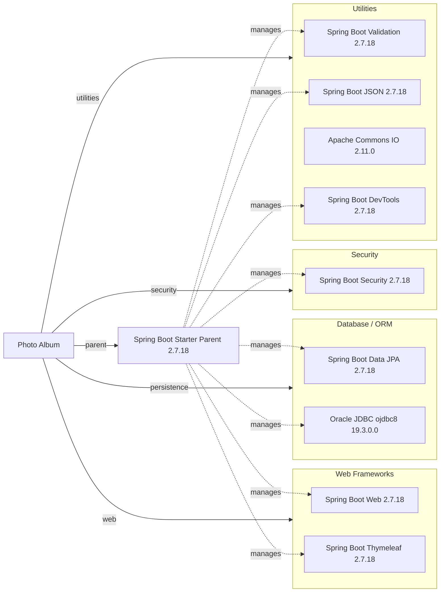

# Dependency Map

Photo Album is a single-module Maven application with 11 declared dependencies: 9 main/runtime dependencies and 2 test-scoped dependencies. Spring Boot 2.7.18 manages versions for dependencies without an explicit version in `pom.xml`.

## Dependencies

### Dependency Summary

| Category | Count | Key Libraries | Notes |
| --- | ---: | --- | --- |
| Web Frameworks | 2 | Spring Boot Web 2.7.18, Thymeleaf starter 2.7.18 | Servlet-based Spring MVC web and server-side templates |
| Database / ORM | 2 | Spring Data JPA starter 2.7.18, Oracle JDBC ojdbc8 19.3.0.0 | Hibernate is supplied transitively by the JPA starter; Oracle driver is runtime-only |
| Security | 1 | Spring Security starter 2.7.18 | Security stack is supplied by Spring Boot |
| Utilities | 4 | Validation, JSON, Commons IO 2.11.0, DevTools 2.7.18 | Three Spring Boot starters plus file utilities; DevTools is optional |

### Version & Compatibility Risks

Spring Boot 2.7.18 and Java 8 are maintenance-era choices and are not the target baseline for current Spring Boot modernization. Moving to Spring Boot 3 or 4 requires a Java upgrade and the Jakarta namespace migration, with likely changes across Spring Security, Hibernate, validation, and Thymeleaf integrations. Commons IO 2.11.0 and the managed Oracle `ojdbc8` version should be reviewed for current security fixes and Java runtime compatibility.

### Notable Observations

- Dependency versions are mostly inherited from the Spring Boot 2.7.18 parent rather than declared directly, so upgrades should account for the parent dependency-management changes.
- `spring-boot-starter-json` is included explicitly even though JSON support is commonly brought in transitively by the web starter; confirm whether the direct declaration is intentional.
- The Oracle JDBC driver is runtime-scoped and the H2 test database is test-scoped, creating a production-versus-test database behavior difference.
- DevTools is optional, which keeps it out of downstream consumers but still adds a development-time dependency to the application build.

## Test Dependencies

| Framework | Version | Notes |
| --- | --- | --- |
| Spring Boot Starter Test | 2.7.18 | Aggregate test starter; brings Spring Test, JUnit 5, Mockito, AssertJ, Hamcrest, JSON path, and Awaitility support |
| H2 Database | 2.1.214 | In-memory database used for tests; version managed by Spring Boot 2.7.18 |

Total test-scope dependencies: 2

The build has a standard Spring Boot test stack and an in-memory database for persistence tests. No dedicated containerized database or contract-testing dependency is declared.
